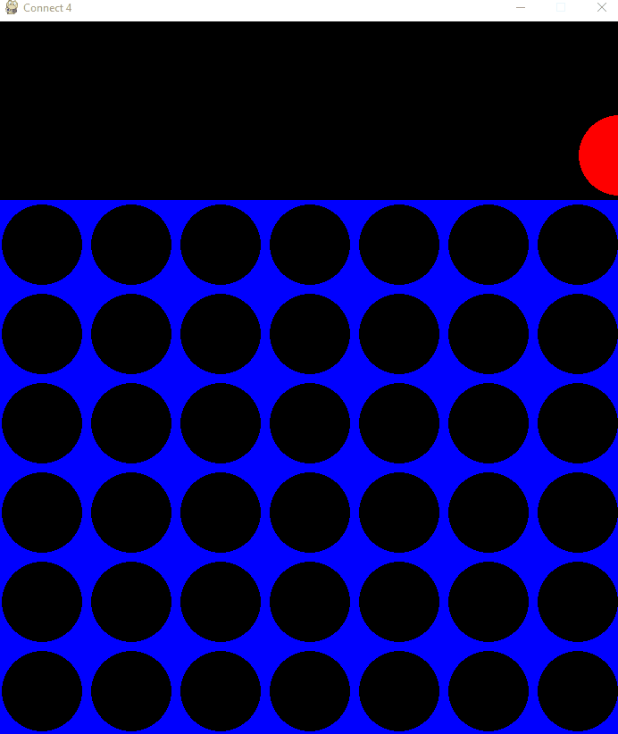
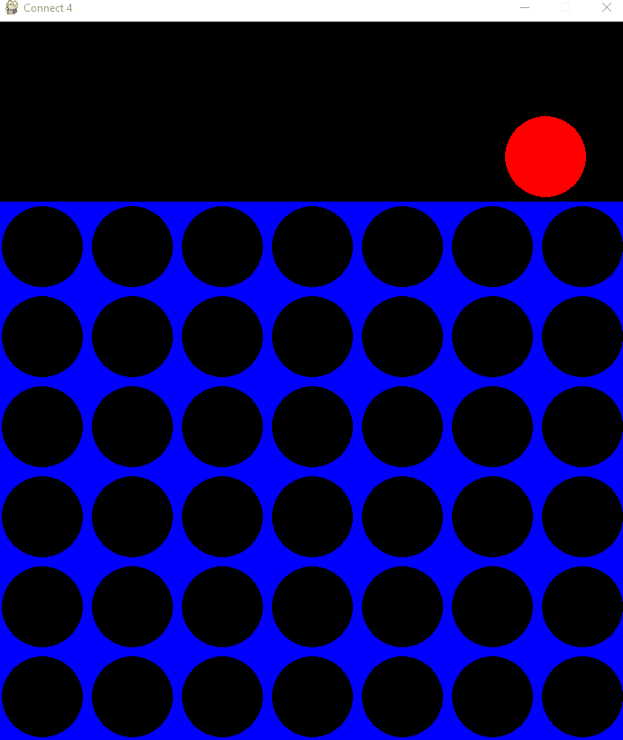
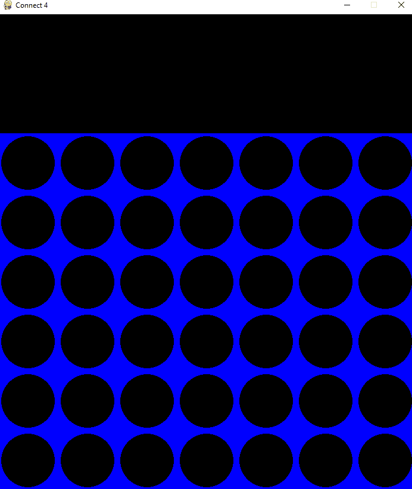

# Connect 4: Minimax & MCTS Artificial Intelligence

A complete implementation of the classic **Connect 4** board game in Python, featuring a custom Graphical User Interface (GUI) built with Pygame and multiple Artificial Intelligence agents. 

This project demonstrates the practical application of advanced search algorithms and game theory, specifically **Minimax with Alpha-Beta Pruning** and **Monte Carlo Tree Search (MCTS)**.

## Gameplay Demos
### Human vs Minimax AI

*Human player testing their skills against the depth-limited Minimax algorithm.*

### Human vs MCTS

*Human player testing their skills against the  Monte Carlo Tree Search algorithm.*

### MCTS AI vs Minimax AI

*Headless/GUI simulation matching the probabilistic Monte Carlo Tree Search(red) against the deterministic Minimax(yellow).*

## Features

* **Multiple Play Modes:** Configure match-ups between Human vs Human, Human vs AI, or AI vs AI.
* **Headless Mode:** Run matches entirely in the console without Pygame rendering for rapid AI performance testing and simulation loops.
* **Optimized Board State:** Core game logic and win-checking are powered by `NumPy` 2D arrays for efficient state copying and validation.
* **Heuristic Evaluation:** The Minimax algorithm utilizes a window-based heuristic, evaluating 4-piece segments and assigning strategic weight to center column control.

## The AI Agents

### 1. Minimax Algorithm (Deterministic Approach)
The Minimax agent (`MinimaxAIPlayer.py`) searches for the optimal move by building a tree of future possibilities up to a defined depth limit (default: 5). It assumes perfect play: maximizing its own score while minimizing the opponent's.

* **Adversarial Search:** The algorithm simulates future game states by alternating between a maximizing turn and a minimizing turn.
* **Heuristic Evaluation (`evaluate_board`):** Since it cannot compute the entire game to the end, it uses a window-based heuristic to score the board state. It evaluates 4-space segments (horizontal, vertical, diagonal):
  * **4 AI pieces:** 100 points (Victory).
  * **3 AI pieces + 1 empty space:** 5 points.
  * **3 Opponent pieces + 1 empty space:** -4 points (Penalty forcing the AI to block threats).
  * **Center Control:** Strategic priority is given to the center column, multiplying its piece count by 3, as controlling the center significantly increases win probability.
* **Alpha-Beta Pruning:** To optimize performance, the algorithm uses `alpha` and `beta` thresholds. If it detects a branch that is mathematically proven to be inferior to a previously evaluated path (`alpha >= beta`), it immediately prunes (stops evaluating) that branch, saving computational power.

### 2. Monte Carlo Tree Search - MCTS (Probabilistic Approach)
The MCTS agent (`MCTSAIPlayer.py`) does not rely on hardcoded heuristics. Instead, it uses statistics and thousands of iterative simulations (default: 1000 iterations) to determine the best move. The process loops through four continuous phases:

* **Selection:** The algorithm traverses down the tree using the **UCB1 (Upper Confidence Bound)** formula. This ensures a perfect balance between *exploration* (trying newly discovered, unvisited nodes) and *exploitation* (heavily visiting paths with a high win rate).
* **Expansion:** When it reaches a board state with untried valid moves, it expands the tree by adding a new node for one of those moves.
* **Simulation (Rollout):** From this newly expanded node, the AI plays a rapid, entirely random game to the end until it reaches a terminal state (win, loss, or draw).
* **Backpropagation:** The outcome of the simulation is propagated back up the tree to the root node. A win adds 1 point, a draw adds 0.5 points. The visit count for every node in that path is incremented. Ultimately, the AI selects the move that was visited the most times.


## Project Structure
```
AIprojectConnect4/
├── README.md
├── docs/
│   ├── ai_vs_ai.gif 
│   ├── human_vs_minimax.gif    
│   └── human_vs_mcts.gif 
├── Connect4Board.py - Core game mechanics, state management, and victory conditions.
├── Connect4Game.py - Main game loop and execution configuration.
├── Connect4Gui.py - Pygame visual rendering and mouse event handling.
├── HumanPlayer.py - Normal Human Player
├── MCTSAIPlayer.py - MCTS AI
├── MinimaxAIPlayer.py - Minimax AI 
├── Player.py - Abstract base class defining the player interface.
└── RandomPlayer.py - Random AI

```

## Installation & Execution

1. Ensure you have Python 3 installed.
2. Install the required dependencies:
   ```bash
   pip install pygame numpy
   ```
3. Open `Connect4Game.py` and configure your desired match-up in the `__main__` block (e.g., set `p1` to `HumanPlayer` and `p2` to `MinimaxAIPlayer`).
4. Run the application:
   ```bash
   python Connect4Game.py
   ```

## Authors

**Gonçalo Sobral** - [GSobral99](https://github.com/GSobral99)

**Rafael Silva**

> The files Connect4GUI.py, Connect4Board.py, Player.py, RandomPlayer.py and part of Connect4Game.py where provided by the professors, not being desenvolved by the Authors